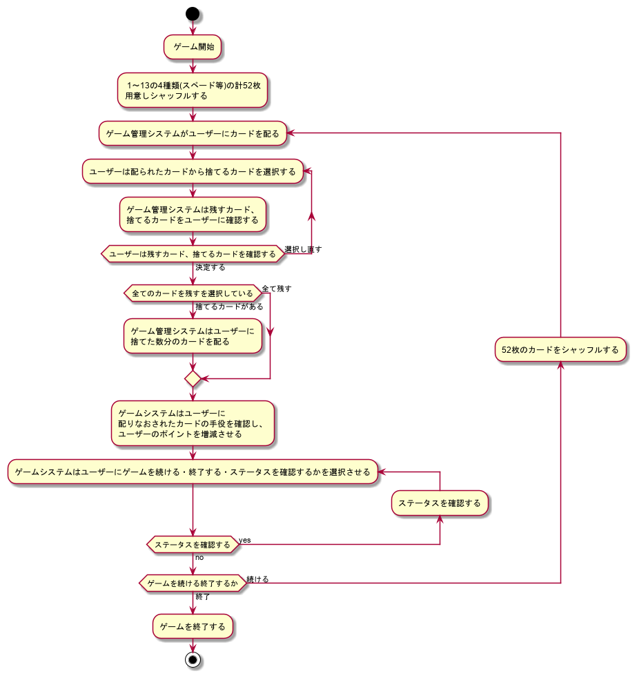
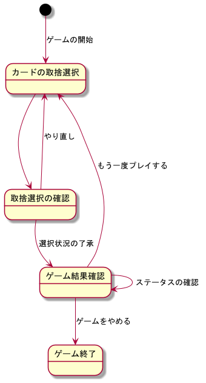
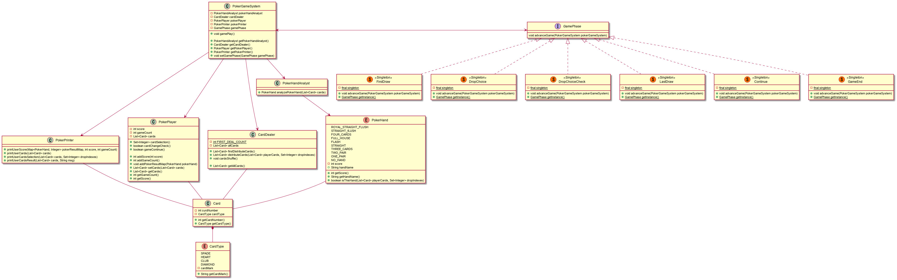

# CLIで遊ぶポーカー

### 何となく思い立ったので作ってみました
web系で作るのであればJavaScriptでいいやになるし、
guiで作るのはしんどいなという感じだったんで、
ぱぱっと作成できるcliで遊ぶ形のアプリとして作成しました。

## 使って頂く場合
### コマンドライン上からプレイする場合
[jarファイル](https://github.com/yasusi-1234/cli_poker_app/blob/master/build/libs/cli_poker_app-1.0.jar)
※ JRE 11 以上のバージョンが必要です

1. 上記リンクへ飛びjarファイルをダウンロード
2. 適当なディレクトリに置いたらコマンドラインを開いて
   (C:\直下に置いた場合　例)C:\cli_poker_app-1.0.jar)
3. cd C:\  (移動)
4. java -jar cli_poker_app-1.0.jar (実行)
5. このコマンドで実行できます

### IDE上からプレイする場合
※ 環境に応じてbuild.gradleファイルの【sourceCompatibility=11】を変更して頂く必要があります
1. ダウンロードしてもらってIDE上に展開してもらって
2. そしてそしてgradleのrunで実行すれば動きます

## ルール
普通の1人用のポーカーゲームです。

カードは1セット全52枚(1～13の番号,4種)で構成
されてます

流れ↓

1. カードを5枚引く
2. 捨てるカードを選ぶ
3. 捨てるカードが合っているか確認する
4. 捨てた分のカードを引く
5. 結果
6. 続ける場合は1へ戻る。やめる場合は終了

上記の様な感じです。

なお 2. の捨てる番号は左から(1,2,3,4,5)から選んで
捨てる番号を入力してください何も入力無しで、Enterキー
を押下した場合は捨てるカードは無しと判定されます

なお 3. 5. の時に 何も入力無しにエンターキーを
押下した場合は(y)と判定されます

### 設計書関連(やっつけ)
design_documentフォルダに格納されています

### フロー図(やっつけ)
フロー図 
### 遷移図(やっつけ)
遷移図 
### クラス図(少しやっつけ)
クラス図 

### 作った感想
作成期間は10日間位かかりました。
ポーカー役の手役判定のロジックを考えるのが楽しかったです。
また各オブジェクトをどの様に設計するかと意識して作成したため
良い機会になったと感じます。
